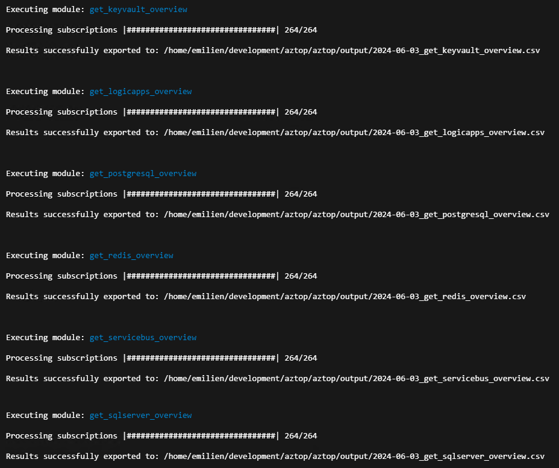

# AZ Tenant Overview Provider (AZTOP)

Simple and extensible framework to acquire a quick and comprehensive overview of an Azure tenant.

## 🔎 Overview

aztop allows visualizing multiple aspects of an Azure environment, by gathering and structuring key configurations into a Comma-Separated Value (CSV) format. 

CSV files can then be visualized as tables to acquire a comprehensive overview of large environements in no time.

### Supported Entra ID resources

- Application permissions granted to service principals

### Supported Azure resources

- Azure Container Registry (ACR)

- App Services / Function Apps

- Disks

- Event Hubs

- Key Vaults

- Logic Apps

- PostgreSQL servers

- Redis databases

- Service Buses

- SQL servers

- Storage Accounts


### Other supported overviews

- Overview of all user- and system-assigned Managed Identity (MI) with their associated consumer(s)

- Overview of inbound connections in all Network Security Groups (NSGs)

- Overview of all hostnames handled by all Load Balancers

## 📷 Screenshots




### Example output for: SQL Servers


### Example output for: Storage Accounts


## ✔️ Prerequisites

- Python 3 ([instructions](https://www.python.org/downloads/))
- An Entra ID identity with:
  - Global Reader to Entra ID (for entra modules)
  - Reader access to the Azure subscription(s) that should be analyzed (for azure modules)


## 🔌 Installation 

From the package's root directory, follow the instructions below.

### 1. Create a Python virtual environment:

```shell
pipenv shell
```

### 2. Install all the Python packages required by aztop:

```shell
pipenv install -r requirements.txt
```


## ⚡ Usage

aztop is an interactive tool. Authentication is therefore performed interactively via a web browser, unless an access token is passed manually.

### Using a member account

**Scenario**: "I want to analyze a tenant with a user account who is a <u>member</u> of that tenant"

```shell
python aztop/aztop.py
```

### Using a guest account

**Scenario**: "I want to analyze a tenant with a user account who is a <u>guest</u> of that tenant"

```shell
python aztop/aztop.py -tid <guid-of-tenant-to-analyze>
```

### Using an access token acquired by other means

**Scenario**: "I cannot log into the Azure portal and run aztop on the same machine"

```shell
python aztop/aztop.py -arm <access-token-value>
```
```shell
python aztop/aztop.py -graph <access-token-value>
```

There are situations where the need to pass an access token manually to aztop might be useful. 

Typical examples are:

- Access to the Azure portal is limited to a compliant device where no tools can be installed and/or imported

- The machine where aztop is running does not have a web browser to sign in interactively (i.e. no GUI available)

Extracting an access token from the Azure portal, where a test user is already authenticated to the right tenant and passing it to aztop can be an easy way to get around such limitations.

### Scanning specific Azure subscriptions

**Scenario**: "I have access to a large number of subscriptions but only want to scan a subset of them"

```shell
python aztop/aztop.py -sub <sub_1_uuid>,<sub_2_uuid>,<sub_x_uuid>
```

Note that aztop scans all subscriptions that an ARM access token provides access to by default.


## 📊 Visualizing csv data

For each module executed by aztop, a csv file of the following format will be generated in the `aztop/output` directory:
- yyyy-mm-dd_\<module-name\>.csv

Examples:
- 2022-03-11_get_acr_overview.csv
- 2022-08-31_get_appservice_overview.csv
- 2022-12-24_get_keyvault_overview.csv

Although any csv viewer can be used to visualize the files in table format, the easiest approach is to use [Visual Studio Code](https://code.visualstudio.com/download) and its [Excel Viewer](https://marketplace.visualstudio.com/items?itemName=GrapeCity.gc-excelviewer) extension.

Once installed, the visualization of all CSV files produced by aztop can easily be instantiated from the terminal as follows:

```shell
code aztop/output/*
```

## 🚩 Known issues

### Rate limiting on the ARM API

**Solution: Be patient and get a coffee**

The API for the Azure Resource Manager (ARM) sets a limit for the number of operations allowed within a tenant, subscription and individual resource provider. You might therefore experience request throttling when scanning a very large environment.

Note that aztop automatically handles throttling limitations, by parsing the amount of time the ARM API requires you to wait (i.e. that number of seconds is served as a "Retry-After" header in the server response from the ARM API).

When rate limiting kicks in, you will see the following string appearing next to the aztop spinner:

`Throttled for <number-of-seconds-to-wait>s. Be patient ...`

More info about rate limiting in ARM: https://docs.microsoft.com/en-us/azure/azure-resource-manager/management/request-limits-and-throttling


## 🤝 Contributing to the project

aztop aims to be a modular framework, where new modules can be plugged into the tool easily. To get started with the developement of a new module, the below procedure is recommended.

### Step 1: Find a module category 

Check if the `aztop/modules` directory contains a category that will suit your new module.

For example, the "azure/resources" category suits modules providing a complete overview of specific types of resources, while the "azure/networking" category provides overviews of network configurations.

In case no category fits the purpose of your future module, feel free to create a new category by simply creating a new subdirectory of `aztop/modules/entra` or `aztop/modules/azure` with a self-explanatory name and <u>without</u> space.

* Example: `aztop/modules/entra/conditional-access`

Note that most Azure modules will suit the "resources" category.

### Step 2: Move the module template to the correct category

Copy the `aztop/template/module_template.py` file to the category of your choice and rename it using the following format `<get-[purpose]-overview.py>`.

* Example: `aztop/modules/azure/resources/get-apim-overview.py`

Note that the above example is for a module providing a complete overview of API Management (APMI) resources.

### Step 3: Make yourself familiar with the module template

At this point, the source code of the module template should be self-explanatory.

Start by refactoring the code with the name of the resource processed by your module, as explained in the description of the `Module()` class within the template.

#### General guidelines

The main part of a resource's configuration is located in its `properties` field. The creation of a new modules consists therefore of parsing the results from that field into a data structure that can be exported to the CSV format.

Note that all endpoints in the MS Graph and ARM APIs return data in json.

The values available in the `properties` field of an Entra ID or Azure resource can be found in the resource's official documentation for Microsoft Graph or ARM: 
- https://docs.microsoft.com/en-us/rest/api/azure/
- https://learn.microsoft.com/en-us/graph/api/overview?view=graph-rest-1.0

#### About networking

The retrievial of Azure network information is already taken care of by the module template.
ARM APIs tend however to be inconsistent. In case, the network information of the resource processed by your module is formatted and/or located in an uncommon place, you will most likely need to implement that part yourself.

Request throttling that may occur when retrieving the content of a resource via its resource provider is also taken care of by the module template (see the `aztop/arm.py/get_resource_content_using_multiple_api_versions()` function for more info on how this is hanlded). 
